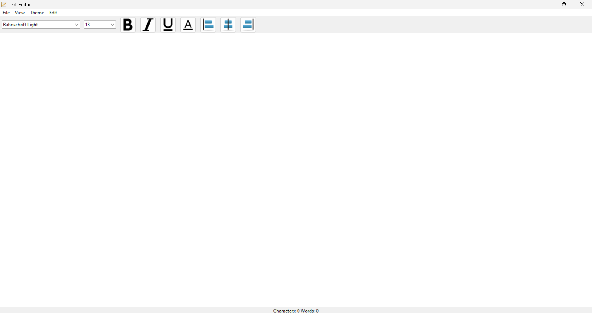

# Text Editor App

This project aims to create a user-friendly text editor app as an alternative to traditional "Notepad" or similar applications.

## Introduction
Introduction
Welcome to the Python File Text Editor project! Built using Tkinter, this text editor offers a user-friendly interface and a range of powerful features 
to enhance your text editing experience. With the ability to customize fonts, change font colors, and utilize various handy tools, our text editor 
takes your productivity to the next level. It's like a notepad, but better! 😁😁😁😁😁

As you explore the text editor, you'll discover a plethora of options to tailor your editing environment to suit your preferences. 
From selecting your favorite fonts to adjusting colors that inspire your creativity, our text editor empowers you to create and modify your text with ease.

Whether you're a professional writer, a developer, or simply someone who enjoys expressing thoughts through words,
my Python File Text Editor is designed to meet your needs. It's time to elevate your text editing experience and unleash your creativity!

## Project Screenshots

GUI

## Contact

www.linkedin.com/in/joseperuby
